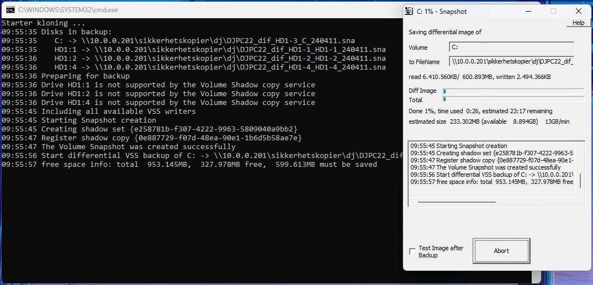

## Drive Snapshot Klientpakke

**Når planlagt oppgave kjører (lukkes av seg selv igjen):**  
 

Du trenger [Drive Snapshot](http://www.drivesnapshot.de/en/) for å bruke disse skriptene.  

**Sikkerhetskopi-løsning for Windows**  
Sikkerhetskopier er hos mange sterkt undervurdert, helt til det går noe galt med benyttet lagringsmedium. 
Det er ikke snakk om når noe slikt kan skje, men når. Og det er heller ingen andre sitt ansvar, enn data-eier. 
Etter å ha prøvd flere løsninger (Microsoft sine egne, Veeam, Macrium, ++) har jeg i 3år+ brukt Drive Snapshot. 

- Ekstremt lite fotavtrykk, både lagring- og ytelsesmessig.  
- Portabelt.  
- Støtter både lokal og nettverkslagring.  
- Åpner seg ved kjøring og lukker seg når ferdig.  
- Kan montere sikkerhetskopien til bokstav og gjenopprette individuelle filer.  
- Differensiell sikkerhetskopiering, effektiv benyttelse av lagring.  
- Roterer antall dager man velger i skriptet.  
- Det bare funker, både på servere og arbeidsstasjoner.  
- Ingen minnelekasjer, heng eller annet tull.  

Testen er utført på en arbeidsplass med 5 arbeidsstasjoner og 1 server.  
Det er regelmessig (noen måneders intervall) testet gj.oppretting og integritet av kopier.  

Programmet ser kanskje enkelt ut, men har hittil vært en tungvekter i form av ren funksjonsverdi. 
Litt teknisk innsikt kan være greit ved oppsett, men ikke særlig mer enn hva en generisk IT entusiast burde klare.  